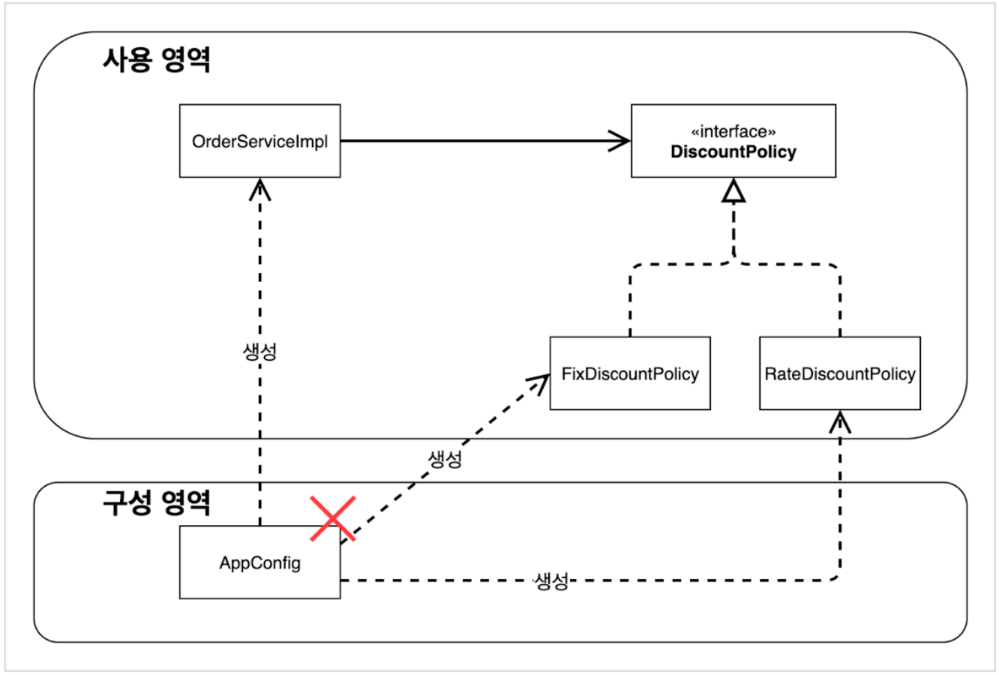
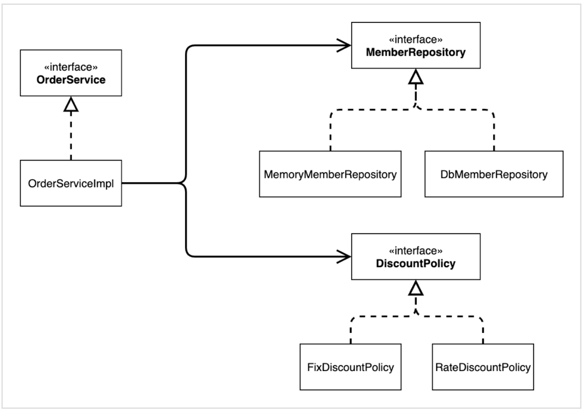
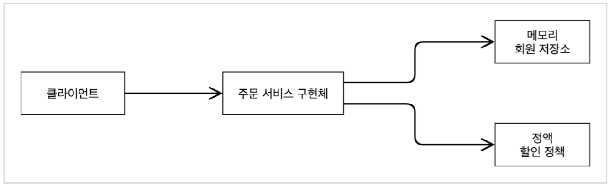
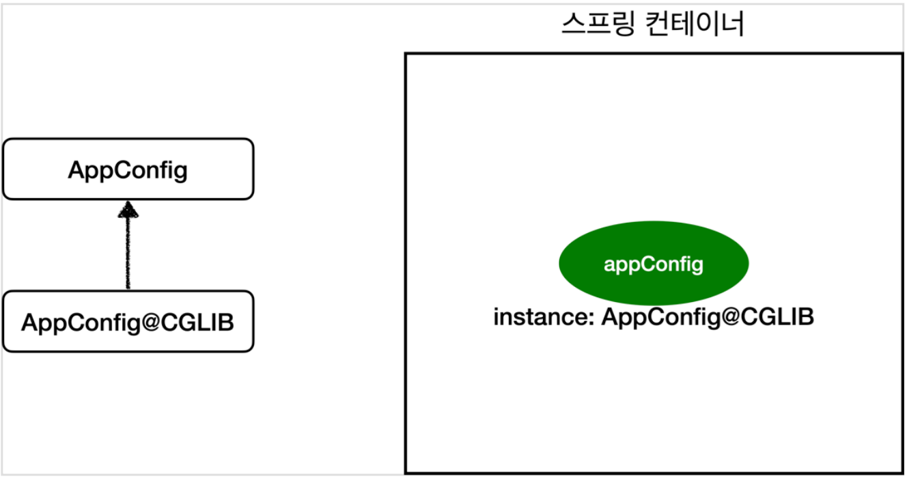

# 김영한님 스프링 핵심 원리 - 기본편 스터디

EJB 가 있었다. 너무 복잡하고 EJB 에 의존적인 코드가 많이 들어간다.

POJO!!

### 스프링 핵심

자바 언어 기반의 프레임워크

자바 - 객체 지향 언어

스프링은 객체 지향 언어가 가진 강력한 특징을 살려내는 프레임워크

스프링은 좋은 객체 지향 애플리케이션을 개발할 수 있게 도와주는 프레임워크

### 객체 지향

- 특징
    - 추상화
    - 캡슐화
    - 상속
    - 다형성
- 객체 지향 프로그래밍
    - 객체 들의 모임
    - 객체는 메시지를 주고 받고, 데이터를 처리할 수 있다.(협력)
    - 유연하고 변경이 용이하다.
        - 다형성 때문이다.
- **다형성(Polymorphism)**
    - 역할(인터페이스)을 다양하게 구현(서브클래스)
    - 클라이언트는 인터페이스에만 의존
    - 구현은 무한히 확장 가능하다. 변경하지 않고 확장할 수 있다.
- 역할과 구현으로 구분하면 세상이 단순해지고, 유연해지며 변경도 편리해진다.
    - 장점
        - 클라이언트는 대상의 역할(인터페이스)만 알면 된다.
        - 클라이언트는 구현 대상의 내부 구조를 몰라도 된다.
        - 클라이언트는 구현 대상의 내부 구조가 변경되어도 영향을 받지 않는다.
        - 클라이언트는 구현 대상 자체를 변경해도 영향을 받지 않는다.
- 자바 언어의 다형성을 활용
    - **역할** = 인터페이스
    - **구현** = 인터페이스를 구현한 클래스, 구현 객체
    - 객체를 설계할 때 역할과 구현을 명확히 분리
    - 객체 설계시 역할(인터페이스)을 먼저 부여하고, 그 역할을 수행하는 객체
    - 오버라이딩
    - 다형성으로 인터페이스를 구현한 객체를 실행 시점에 유연하게 변경
- 다형성의 본질
    - 인터페이스를 구현한 객체 인스턴스를 **실행 시점에 유연하게 변경**할 수 있다.
    - 다형성의 본질을 이해하려면 협력이라는 객체사이의 관계에서 시작해야함
    - ****클라이언트를 변경하지 않고, 서버의 구현 기능을 유연하게 변경할 수 있다.****
- **역할(인터페이스) 자체가 변하면, 클라이언트, 서버 모두에 큰 변경이 발생한다.**
- **인터페이스를 안정적으로 잘 설계하는 것이 중요**
- 스프링과 객체 지향
    - 다형성이 가장 중요하다.
    - 스프링은 다형성을 극대화
    - Ioc, DI는 다형성을 활용해서 역할과 구현을 편리하게 다룰 수 있도록 지원한다.
    - 스프링을 사용하면 구현을 편리하게 변경할 수 있다.

### 좋은 객체 지향 설계의 5가지 원칙(SOLID)

클린코드로 유명한 로버트 마틴이 좋은 객체 지향 설계의 5가지 원칙을 정리

1. SRP(Single Responsibility Principle): 단일 책임 원칙
    - 한 클래스는 하나의 책임만 가져야 한다.
    - 하나의 책임이라는 것은 모호하다.
        - 클 수 있고, 작을 수 있다.
        - 문맥과 상황에 따라 다르다.
    - **중요한 기준은 변경**이다. 변경이 있을 때 파급 효과가 적으면 단일 책임 원칙을 잘 따른 것
    - 예) UI 변경, 객체의 생성과 사용을 분리
2. OCP(Open Closed Principle): 개방 폐쇄 원칙
    - 소프트웨어 요소는 **확장에는 열려 있으나, 변경에는 닫혀 있어야 한다.**
    - **다형성**을 활용해보자
    - 인터페이스를 구현한 새로운 클래스를 하나 만들어서 새로운 기능을 구현
    - 역할과 구현의 분리
    - 문제점

        ```java
        public class MemberService {
            // private MemberRepository repository = new MemoryMemberRepository();
            private MemberRepository repository = new JdbcMemberRepository();
        }
        ```

        - 구현 객체를 변경하려면 클라이언트 코드를 변경해야 한다.
        - 분명 다형성을 사용했지만 OCP 원칙을 지킬 수 없다.
        - 이 문제를 어떻게 해결해야 하나?
        - 객체를 생성하고, 연관관계를 맺어주는 별도의 조립, 설정자가 필요하다.
3. LSP(the Liskov Substitution Principle): 리스코브 치환 원칙
    - 프로그램의 객체는 프로그램의 정확성을 깨뜨리지 않으면서 하위 타입의 인스턴스로 바꿀 수 있어야 한다.
    - 다형성에서 하위 클래스는 인터페이스 규약을 다 지켜야 한다는 것, 다형성을 지원하기 위한 원칙, 인터페이스를 구현한 구현체는 믿고 사용하려면, 이 원칙이 필요하다.
4. ISP(Interface Segregation Principle): 인터페이스 분리 원칙
    - 특정 클라이언트를 위한 인터페이스 여러 개가 범용 인터페이스 하나보다 낫다.
    - 분리하면 인터페이스 자체가 변해도 클라이언트에 영향을 주지 않음
    - 인터페이스가 명확해지고, 대체 가능성이 높아진다.
5. DIP(Dependency Inversion Principle): 의존 역전 원칙
    - 프로그래머는 “추상화에 의존해야지, 구체화에 의존하면 안된다.” 의존성 주입은 이 원칙을 따르는 방법 중 하나다.
    - 쉽게 이야기해서 구현 클래스에 의존하지 말고, 인터페이스에 의존하라는 뜻
    - 앞에서 이야기한 **역할(Role)에 의존하게 해야 한다는 것과 같다.** 객체 세상도 클라이언트가 인터페이스에 의존해야 유연하게 구현체를 변경할 수 있다! 구현체에 의존하게 되면 변경이 아주 어려워진다.
    - OCP에서 설명한 MemberService는 인터페이스에 의존하지만, 구현 클래스도 동시에 의존한다.
    - MemberService 클라이언트가 구현 클래스를 직접 선택
    - MemberRepository m = new **MemoryMemberRepository**();
    - **DIP 위반**
- 정리
    - 객체 지향의 핵심은 다형성
    - 다형성 만으로는 쉽게 부품을 갈아 끼우듯이 개발할 수 없다.
    - 다형성 만으로는 구현 객체를 변경할 때 클라이언트 코드도 함께 변경된다.
    - **다형성 만으로는 OCP, DIP를 지킬 수 없다.**
    - 뭔가 더 필요하다.

### 스프링

- **스프링은 다음 기술로 다형성 + OCP, DIP를 가능하게 지원**
    - DI(Dependency Injection): 의존관계, 의존성 주입
    - DI 컨테이너 제공
- **클라이언트 코드의 변경 없이 기능 확장**
- `순수하게 자바로 OCP, DIP 원칙들을 지키면서 개발을 해보면, 결국 스프링 프레임워크를
  만들게 된다. (더 정확히는 DI 컨테이너)`

### 정리

- 모든 설계에 **역할과 구현을 분리**하자.
- 이상적으로는 모든 설계에 인터페이스를 부여하자
- 고민
    - 하지만 인터페이스를 도입하면 추상화라는 비용(구현 클래스 확인)이 발생한다.
    - 기능을 확장할 가능성이 없다면, 구체 클래스를 직접 사용하고, 향후 꼭 필요할 때 리팩터
      링해서 인터페이스를 도입하는 것도 방법이다.
- 역할들의 협력 관계를 그대로 재사용할 수 있다.

### AppConfig 를 만들어서 사용 영역과 구성 영역 분리



관심사의 분리

한 객체는 하나의 책임만

### **좋은 객체 지향 설계의 5가지 원칙의 적용**

여기서 3가지 SRP, DIP, OCP 적용

- **SRP 단일 책임 원칙**

  **한 클래스는 하나의 책임만 가져야 한다.**

    - 클라이언트 객체는 직접 구현 객체를 생성하고, 연결하고, 실행하는 다양한 책임을 가지고 있음
    - SRP 단일 책임 원칙을 따르면서 관심사를 분리함
    - 구현 객체를 생성하고 연결하는 책임은 AppConfig가 담당
    - 클라이언트 객체는 실행하는 책임만 담당
- **DIP 의존관계 역전 원칙**

  **프로그래머는 “추상화에 의존해야지, 구체화에 의존하면 안된다.” 의존성 주입은 이 원칙을 따르는 방법 중
  하나다.**

    - 새로운 할인 정책을 개발하고, 적용하려고 하니 클라이언트 코드도 함께 변경해야 했다. 왜냐하면 기존 클라이언트 코드( OrderServiceImpl )는 DIP를 지키며 DiscountPolicy 추상화 인터페이스에
    - 의존하는 것 같았지만, FixDiscountPolicy 구체화 구현 클래스에도 함께 의존했다.
      클라이언트 코드가 DiscountPolicy 추상화 인터페이스에만 의존하도록 코드를 변경했다.
      하지만 클라이언트 코드는 인터페이스만으로는 아무것도 실행할 수 없다.
      AppConfig가 FixDiscountPolicy 객체 인스턴스를 클라이언트 코드 대신 생성해서 클라이언트 코드에 의존관계를 주입했다. 이렇게해서 DIP 원칙을 따르면서 문제도 해결했다.
- **OCP**

  **소프트웨어 요소는 확장에는 열려 있으나 변경에는 닫혀 있어야 한다**

    - 다형성 사용하고 클라이언트가 DIP를 지킴
    - 애플리케이션을 사용 영역과 구성 영역으로 나눔
    - AppConfig가 의존관계를 FixDiscountPolicy RateDiscountPolicy 로 변경해서 클라이언트 코드에 주입하므로 클라이언트 코드는 변경하지 않아도 됨
    - **소프트웨어 요소를 새롭게 확장해도 사용 영역의 변경은 닫혀 있다!**

### **IoC, DI, 그리고 컨테이너**

- **제어의 역전 IoC(Inversion of Control)**
    - 기존 프로그램은 클라이언트 구현 객체가 스스로 필요한 서버 구현 객체를 생성하고, 연결하고, 실행했다. 한마디로 구현 객체가 프로그램의 제어 흐름을 스스로 조종했다. 개발자 입장에서는 자연스러운 흐름이다.
    - 반면에 AppConfig가 등장한 이후에 구현 객체는 자신의 로직을 실행하는 역할만 담당한다. 프로그램의 제어 흐름은 이제 AppConfig가 가져간다. 예를 들어서 OrderServiceImpl 은 필요한 인터페이스들을 호출하지만 어떤 구현 객체들이 실행될지 모른다.
    - 프로그램에 대한 제어 흐름에 대한 권한은 모두 AppConfig가 가지고 있다. 심지어 OrderServiceImpl도 AppConfig가 생성한다. 그리고 AppConfig는 OrderServiceImpl 이 아닌 OrderService 인터페이스의 다른 구현 객체를 생성하고 실행할 수 도 있다. 그런 사실도 모른체 OrderServiceImpl 은 묵묵히 자신의 로직을 실행할 뿐이다.
    - 이렇듯 프로그램의 제어 흐름을 직접 제어하는 것이 아니라 외부에서 관리하는 것을 제어의 역전(IoC)이라 한다.
- **프레임워크 vs 라이브러리**
    - 프레임워크가 내가 작성한 코드를 제어하고, 대신 실행하면 그것은 프레임워크가 맞다. (JUnit)
    - 반면에 내가 작성한 코드가 직접 제어의 흐름을 담당한다면 그것은 프레임워크가 아니라 라이브러리다.
- **의존관계 주입 DI(Dependency Injection)**
    - OrderServiceImpl 은 DiscountPolicy 인터페이스에 의존한다. 실제 어떤 구현 객체가 사용될지는 모른다.
    - 의존관계는 **정적인 클래스 의존 관계와, 실행 시점에 결정되는 동적인 객체(인스턴스) 의존 관계** 둘을 분리해서 생각해야 한다.
- **정적인 클래스 의존관계**
    - 클래스가 사용하는 import 코드만 보고 의존관계를 쉽게 판단할 수 있다. 정적인 의존관계는 애플리케이션을 실행하지 않아도 분석할 수 있다. 클래스 다이어그램을 보자.
      OrderServiceImpl 은 MemberRepository , DiscountPolicy 에 의존한다는 것을 알 수 있다.
      그런데 이러한 클래스 의존관계 만으로는 실제 어떤 객체가 OrderServiceImpl 에 주입 될지 알 수 없다.
- **클래스 다이어그램**

  

- **동적인 객체 인스턴스 의존 관계**
    - 애플리케이션 실행 시점에 실제 생성된 객체 인스턴스의 참조가 연결된 의존 관계다.
- **객체 다이어그램**

  

    - 애플리케이션 **실행 시점(런타임)**에 외부에서 실제 구현 객체를 생성하고 클라이언트에 전달해서 클라이언트와 서버의 실제 의존관계가 연결 되는 것을 **의존관계 주입**이라 한다.
    - 객체 인스턴스를 생성하고, 그 참조값을 전달해서 연결된다.
    - 의존관계 주입을 사용하면 클라이언트 코드를 변경하지 않고, 클라이언트가 호출하는 대상의 타입 인스턴스를 변경할 수 있다.
    - 의존관계 주입을 사용하면 정적인 클래스 의존관계를 변경하지 않고, 동적인 객체 인스턴스 의존관계를 쉽게 변경할 수 있다.
- **IoC 컨테이너, DI 컨테이너**
    - AppConfig 처럼 객체를 생성하고 관리하면서 의존관계를 연결해 주는 것을 IoC 컨테이너 또는 **DI 컨테이너**라 한다.
    - 의존관계 주입에 초점을 맞추어 최근에는 주로 DI 컨테이너라 한다. 또는 어샘블러, 오브젝트 팩토리 등으로 불리기도 한다.

### 웹 애플리케이션과 싱글톤

- **싱글톤 패턴 문제점**
    - 싱글톤 패턴을 구현하는 코드 자체가 많이 들어간다.
    - 의존관계상 클라이언트가 구체 클래스에 의존한다. DIP를 위반한다.
    - 클라이언트가 구체 클래스에 의존해서 OCP 원칙을 위반할 가능성이 높다.
    - 테스트하기 어렵다.
    - 내부 속성을 변경하거나 초기화 하기 어렵다.
    - private 생성자로 자식 클래스를 만들기 어렵다.
    - 결론적으로 유연성이 떨어진다.
    - 안티패턴으로 불리기도 한다.
- 스프링 컨테이너
    - 싱글톤 레지스트리
        - 싱글톤 패턴을 위한 지저분한 코드가 들어가지 않는다.
        - DIP, OCP, 테스트, private 생성자로부터 자유롭게 싱글톤을 사용할 수 있다.

- **싱글톤 방식의 주의점**
    - 싱글톤 패턴이든, 스프링 같은 싱글톤 컨테이너를 사용하든, 객체 인스턴스를 하나만 생성해서 공유하는 싱글톤 방식은 여러 클라이언트가 하나의 같은 객체 인스턴스를 공유하기 때문에 싱글톤 객체는 상태를 유지(stateful)하게 설계하면 안된다.
    - 무상태(stateless)로 설계해야 한다!
    - 특정 클라이언트에 의존적인 필드가 있으면 안된다.
      특정 클라이언트가 값을 변경할 수 있는 필드가 있으면 안된다!
      가급적 읽기만 가능해야 한다.
      필드 대신에 자바에서 공유되지 않는, 지역변수, 파라미터, ThreadLocal 등을 사용해야 한다.
    - 스프링 빈의 필드에 공유 값을 설정하면 정말 큰 장애가 발생할 수 있다!!!

**@Configuration과 바이트코드 조작의 마법**

스프링 컨테이너는 싱글톤 레지스트리다. 따라서 스프링 빈이 싱글톤이 되도록 보장해주어야 한다. 그런데
스프링이 자바 코드까지 어떻게 하기는 어렵다. 저 자바 코드를 보면 분명 3번 호출되어야 하는 것이 맞다.
그래서 스프링은 클래스의 바이트코드를 조작하는 라이브러리를 사용한다.

```
com.give928.springcore.AppConfig$$EnhancerBySpringCGLIB$$5fe16520@119020fb
```

그런데 예상과는 다르게 클래스 명에 xxxCGLIB가 붙으면서 상당히 복잡해진 것을 볼 수 있다. 이것은 내가 만든 클래스가 아니라 스프링이 CGLIB라는 바이트코드 조작 라이브러리를 사용해서 AppConfig 클래스를 상속받은 임의의 다른 클래스를 만들고, 그 다른 클래스를 스프링 빈으로 등록한 것이다!



@Configuration 애너테이션이 없으면 AppConfig@CGLIB 클래스가 생성되지 않는다. 내부에 선언된 @Bean들의 싱글톤이 보장되지 않는다.

@Bean 만 사용해도 스프링 빈으로 등록되지만, 싱글톤을 보장하지 않는다.

### **컴포넌트 스캔**

- 컴포넌트 스캔을 사용하려면 먼저 @ComponentScan 을 설정 정보에 붙여주면 된다.
    - 컴포넌트 스캔은 이름 그대로 @Component 애노테이션이 붙은 클래스를 스캔해서 스프링 빈으로 등록한다.
    - 생성자에 @Autowired 를 지정하면, 스프링 컨테이너가 자동으로 해당 스프링 빈을 찾아서 주입한다.
- **탐색할 패키지의 시작 위치 지정**
    - basePackages : 탐색할 패키지의 시작 위치를 지정한다. 이 패키지를 포함해서 하위 패키지를 모두 탐색한다.
    - 지정하지 않으면 @ComponentScan 이 붙은 설정 정보 클래스의 패키지가 시작 위치가 된다.
    - 권장: 개인적으로 즐겨 사용하는 방법은 패키지 위치를 지정하지 않고, 설정 정보 클래스의 위치를 프로젝트 최상단에 두는 것이다. 최근 스프링 부트도 이 방법을 기본으로 제공한다.
- **컴포넌트 스캔 기본 대상**
    - @Component : 컴포넌트 스캔에서 사용
      @Controlller : 스프링 MVC 컨트롤러에서 사용
      @Service : 스프링 비즈니스 로직에서 사용
      @Repository : 스프링 데이터 접근 계층에서 사용
      @Configuration : 스프링 설정 정보에서 사용
    - 참고: 사실 애노테이션에는 상속관계라는 것이 없다. 그래서 이렇게 애노테이션이 특정 애노테이션을 들고 있는 것을 인식할 수 있는 것은 자바 언어가 지원하는 기능은 아니고, 스프링이 지원하는 기능이다.
    - @Controller : 스프링 MVC 컨트롤러로 인식
      @Repository : 스프링 데이터 접근 계층으로 인식하고, 데이터 계층의 예외를 스프링 예외로 변환해준다.
      @Configuration : 앞서 보았듯이 스프링 설정 정보로 인식하고, 스프링 빈이 싱글톤을 유지하도록 추가 처리를 한다.
      @Service : 사실 @Service 는 특별한 처리를 하지 않는다. 대신 개발자들이 핵심 비즈니스 로직이 여기에 있겠구나 라고 비즈니스 계층을 인식하는데 도움이 된다.
- **필터**
    - includeFilters : 컴포넌트 스캔 대상을 추가로 지정한다.
    - excludeFilters : 컴포넌트 스캔에서 제외할 대상을 지정한다

    ```java
    @ComponentScan(
            includeFilters = {@Filter(type = FilterType.ANNOTATION, classes = MyIncludeComponent.class)},
            excludeFilters = {
                    @Filter(type = FilterType.ANNOTATION, classes = MyExcludeComponent.class), 
                    @Filter(type = FilterType.ASSIGNABLE_TYPE, classes = BeanA.class)
            })
    ```


### 의존관계 자동 주입

의존관계 주입 방법

- 생성자 주입
    - 생성자 호출시점에 딱 1번만 호출되는 것이 보장된다.
    - **불변, 필수** 의존관계에 사용
    - **생성자가 딱 1개만 있으면 @Autowired를 생략해도 자동 주입 된다.** 물론 스프링 빈에만 해당한다.
- 수정자 주입(setter 주입)
    - **선택, 변경** 가능성이 있는 의존관계에 사용
    - 자바빈 프로퍼티 규약의 수정자 메서드 방식을 사용하는 방법이다.
- 필드 주입
    - 코드가 간결해서 많은 개발자들을 유혹하지만 외부에서 변경이 불가능해서 테스트 하기 힘들다는
      치명적인 단점이 있다.
    - DI 프레임워크가 없으면 아무것도 할 수 없다.
    - 사용하지 말자!
        - 애플리케이션의 실제 코드와 관계 없는 테스트 코드
        - 스프링 설정을 목적으로 하는 @Configuration 같은 곳에서만 특별한 용도로 사용
- 일반 메서드 주입
    - 한번에 여러 필드를 주입 받을 수 있다.
    - 일반적으로 잘 사용하지 않는다.

**생성자 주입을 선택해라!**과거에는 수정자 주입과 필드 주입을 많이 사용했지만, 최근에는 스프링을 포함한 DI 프레임워크 대부분이 생성자 주입을 권장한다. 그 이유는 다음과 같다.

- **불변**

  대부분의 의존관계 주입은 한번 일어나면 애플리케이션 종료시점까지 의존관계를 변경할 일이 없다. 오히려
  대부분의 의존관계는 애플리케이션 종료 전까지 변하면 안된다.(불변해야 한다.)
  수정자 주입을 사용하면, setXxx 메서드를 public으로 열어두어야 한다.
  누군가 실수로 변경할 수 도 있고, 변경하면 안되는 메서드를 열어두는 것은 좋은 설계 방법이 아니다.
  생성자 주입은 객체를 생성할 때 딱 1번만 호출되므로 이후에 호출되는 일이 없다. 따라서 불변하게 설계할
  수 있다.

- **누락**
  생성자 주입을 사용하면 다음처럼 주입 데이터를 누락 했을 때 **컴파일 오류**가 발생한다.
  `java: variable discountPolicy might not have been initialized`
  기억하자! **컴파일 오류는 세상에서 가장 빠르고, 좋은 오류다!**

**final 키워드**

생성자 주입을 사용하면 필드에 final 키워드를 사용할 수 있다. 그래서 생성자에서 혹시라도 값이
설정되지 않는 오류를 컴파일 시점에 막아준다.

**정리**

- 생성자 주입 방식을 선택하는 이유는 여러가지가 있지만, 프레임워크에 의존하지 않고, 순수한 자바 언어의
  특징을 잘 살리는 방법이기도 하다.
- 기본으로 생성자 주입을 사용하고, 필수 값이 아닌 경우에는 수정자 주입 방식을 옵션으로 부여하면 된다.
  생성자 주입과 수정자 주입을 동시에 사용할 수 있다.
- 항상 생성자 주입을 선택해라! 그리고 가끔 옵션이 필요하면 수정자 주입을 선택해라. 필드 주입은 사용하지
  않는게 좋다.

**롬복과 최신 트랜드**

롬복 라이브러리가 제공하는 @RequiredArgsConstructor 기능을 사용하면 final이 붙은 필드를 모아서
생성자를 자동으로 만들어준다.
롬복이 자바의 애노테이션 프로세서라는 기능을 이용해서 컴파일 시점에 생성자 코드를 자동으로 생성해준다.
최근에는 생성자를 딱 1개 두고, @Autowired 를 생략하는 방법을 주로 사용한다. 여기에 Lombok 라이브러리의 @RequiredArgsConstructor 함께 사용하면 기능은 다 제공하면서, 코드는 깔끔하게 사용할 수 있다.

**조회 빈이 2개 이상 - 문제**

- @Autowired 필드 명 매칭
- @Qualifier @Qualifier끼리 매칭 빈 이름 매칭
- @Primary 사용

**@Primary, @Qualifier 활용**코드에서 자주 사용하는 메인 데이터베이스의 커넥션을 획득하는 스프링 빈이 있고, 코드에서 특별한 기능으로 가끔 사용하는 서브 데이터베이스의 커넥션을 획득하는 스프링 빈이 있다고 생각해보자. 메인 데이터베이스의 커넥션을 획득하는 스프링 빈은 @Primary 를 적용해서 조회하는 곳에서 @Qualifier
지정 없이 편리하게 조회하고, 서브 데이터베이스 커넥션 빈을 획득할 때는 @Qualifier 를 지정해서 명시적으로 획득 하는 방식으로 사용하면 코드를 깔끔하게 유지할 수 있다. 물론 이때 메인 데이터베이스의 스프링 빈을 등록할 때 @Qualifier 를 지정해주는 것은 상관없다.

**우선순위**

@Primary 는 기본값 처럼 동작하는 것이고, @Qualifier 는 매우 상세하게 동작한다. 이런 경우 어떤 것이 우선권을 가져갈까? 스프링은 자동보다는 수동이, 넒은 범위의 선택권 보다는 좁은 범위의 선택권이 우선 순위가 높다. 따라서 여기서도 @Qualifier 가 우선권이 높다.

**애노테이션 직접 만들기**

```java
@Qualifier("mainDiscountPolicy")
public @interface MainDiscountPolicy {
}

@MainDiscountPolicy
public class RateDiscountPolicy implements DiscountPolicy {}

//생성자 자동 주입
@Autowired
public OrderServiceImpl(MemberRepository memberRepository, @MainDiscountPolicy DiscountPolicy discountPolicy) {
    this.memberRepository = memberRepository;
    this.discountPolicy = discountPolicy;
}
```

애노테이션에는 상속이라는 개념이 없다. 이렇게 여러 애노테이션을 모아서 사용하는 기능은 스프링이 지원해주는 기능이다.

**조회한 빈이 모두 필요할 때, List, Map**

의도적으로 정말 해당 타입의 스프링 빈이 다 필요한 경우도 있다.
예를 들어서 할인 서비스를 제공하는데, 클라이언트가 할인의 종류(rate, fix)를 선택할 수 있다고 가정해보자.
스프링을 사용하면 소위 말하는 전략 패턴을 매우 간단하게 구현할 수 있다.

### 자동, 수동의 올바른 실무 운영 기준

**편리한 자동 기능을 기본으로 사용하자**

스프링이 나오고 시간이 갈 수록 점점 자동을 선호하는 추세다. 스프링은 @Component 뿐만 아니라 @Controller , @Service , @Repository 처럼 계층에 맞추어 일반적인 애플리케이션 로직을 자동으로 스캔할 수 있도록 지원한다. 거기에 더해서 최근 스프링 부트는 컴포넌트 스캔을 기본으로 사용하고, 스프링 부트의 다양한 스프링 빈들도 조건이 맞으면 자동으로 등록하도록 설계했다.

설정 정보를 기반으로 애플리케이션을 구성하는 부분과 실제 동작하는 부분을 명확하게 나누는 것이 이상적이지만, 개발자 입장에서 스프링 빈을 하나 등록할 때 @Component 만 넣어주면 끝나는 일을 @Configuration 설정 정보에 가서 @Bean 을 적고, 객체를 생성하고, 주입할 대상을 일일이 적어주는 과정은 상당히 번거롭다.

또 관리할 빈이 많아서 설정 정보가 커지면 설정 정보를 관리하는 것 자체가 부담이 된다.
그리고 결정적으로 자동 빈 등록을 사용해도 OCP, DIP를 지킬 수 있다.

**그러면 수동 빈 등록은 언제 사용하면 좋을까?**

애플리케이션은 크게 업무 로직과 기술 지원 로직으로 나눌 수 있다.

- **업무 로직 빈:** 웹을 지원하는 컨트롤러, 핵심 비즈니스 로직이 있는 서비스, 데이터 계층의 로직을 처리하는 리포지토리등이 모두 업무 로직이다. 보통 비즈니스 요구사항을 개발할 때 추가되거나 변경된다.
- **기술 지원 빈:** 기술적인 문제나 공통 관심사(AOP)를 처리할 때 주로 사용된다. 데이터베이스 연결이나, 공통 로그 처리 처럼 업무 로직을 지원하기 위한 하부 기술이나 공통 기술들이다.

업무 로직은 숫자도 매우 많고, 한번 개발해야 하면 컨트롤러, 서비스, 리포지토리 처럼 어느정도 유사한 패턴이 있다. 이런 경우 자동 기능을 적극 사용하는 것이 좋다. 보통 문제가 발생해도 어떤 곳에서 문제가 발생했는지 명확하게 파악하기 쉽다.

기술 지원 로직은 업무 로직과 비교해서 그 수가 매우 적고, 보통 애플리케이션 전반에 걸쳐서 광범위하게 영향을 미친다. 그리고 업무 로직은 문제가 발생했을 때 어디가 문제인지 명확하게 잘 들어나지만, 기술 지원 로직은 적용이 잘 되고 있는지 아닌지 조차 파악하기 어려운 경우가 많다. 그래서 이런 기술 지원 로직들은 가급적 수동 빈 등록을 사용해서 명확하게 들어내는 것이 좋다.

**애플리케이션에 광범위하게 영향을 미치는 기술 지원 객체는 수동 빈으로 등록해서 딱! 설정 정보에 바로
나타나게 하는 것이 유지보수 하기 좋다.**

**비즈니스 로직 중에서 다형성을 적극 활용할 때 수동으로 설정하는 것도 좋다.**

**스프링과 스프링 부트가 자동으로 등록하는 수 많은 빈들은 예외**

**스프링 부트가 아니라 내가 직접 기술 지원 객체를 스프링 빈으로 등록한다면 수동으로 등록해서 명확하게 들어내는 것이 좋다.**

**정리**

편리한 자동 기능을 기본으로 사용하자
직접 등록하는 기술 지원 객체는 수동 등록
다형성을 적극 활용하는 비즈니스 로직은 수동 등록을 고민해보자

### 빈 생명주기 콜백

데이터베이스 커넥션 풀이나, 네트워크 소켓처럼 애플리케이션 시작 시점에 필요한 연결을 미리 해두고, 애플리케이션 종료 시점에 연결을 모두 종료하는 작업을 진행하려면, 객체의 초기화와 종료 작업이 필요하다.

```java
ConfigurableApplicationContext ac = new AnnotationConfigApplicationContext(LifeCycleConfig.class);
ac.close();
```

생성자 주입이 아닌 경우 스프링 빈은 간단하게 다음과 같은 라이프사이클을 가진다.
**객체 생성 → 의존관계 주입**

스프링 빈은 객체를 생성하고, 의존관계 주입이 다 끝난 다음에야 필요한 데이터를 사용할 수 있는 준비가 완료된다. 따라서 초기화 작업은 의존관계 주입이 모두 완료되고 난 다음에 호출해야 한다.

**스프링은 의존관계 주입이 완료되면 스프링 빈에게 콜백 메서드를 통해서 초기화 시점을 알려주는 다양한 기능을 제공**한다. 또한 **스프링은 스프링 컨테이너가 종료되기 직전에 소멸 콜백**을 준다. 따라서 안전하게 종료 작업을 진행할 수 있다.

**스프링 빈의 이벤트 라이프사이클
스프링 컨테이너 생성 → 스프링 빈 생성 → 의존관계 주입 → 초기화 콜백 → 사용 → 소멸전 콜백 → 스프링 종료**

- **초기화 콜백**: 빈이 생성되고, 빈의 의존관계 주입이 완료된 후 호출
- **소멸전 콜백**: 빈이 소멸되기 직전에 호출

**참고: 객체의 생성과 초기화를 분리하자.**

생성자는 필수 정보(파라미터)를 받고, 메모리를 할당해서 객체를 생성하는 책임을 가진다. 반면에 초기화는 이렇게 생성된 값들을 활용해서 외부 커넥션을 연결하는등 무거운 동작을 수행한다.

따라서 생성자 안에서 무거운 초기화 작업을 함께 하는 것 보다는 객체를 생성하는 부분과 초기화 하는 부분을 명확하게 나누는 것이 유지보수 관점에서 좋다. 물론 초기화 작업이 내부 값들만 약간 변경하는 정도로 단순한 경우에는 생성자에서 한번에 다 처리하는게 더 나을 수 있다.

**스프링은 크게 3가지 방법으로 빈 생명주기 콜백을 지원한다.**

- 인터페이스(InitializingBean, DisposableBean)
    - 이 인터페이스는 스프링 전용 인터페이스다. 해당 코드가 스프링 전용 인터페이스에 의존한다.
    - 초기화, 소멸 메서드의 이름을 변경할 수 없다.
    - 내가 코드를 고칠 수 없는 외부 라이브러리에 적용할 수 없다
    - 인터페이스를 사용하는 초기화, 종료 방법은 스프링 초창기에 나온 방법들이고, 지금은 다음의 더 나은 방법들이 있어서 거의 사용하지 않는다.
- 설정 정보에 초기화 메서드, 종료 메서드 지정
    - 설정 정보에 @Bean(initMethod = "init", destroyMethod = "close") 처럼 초기화, 소멸 메서드를 지정할 수 있다.
    - 설정 정보 사용 특징
        - 메서드 이름을 자유롭게 줄 수 있다.
        - 스프링 빈이 스프링 코드에 의존하지 않는다.
        - 코드가 아니라 설정 정보를 사용하기 때문에 코드를 고칠 수 없는 외부 라이브러리에도 초기화, 종료
          메서드를 적용할 수 있다.
    - 종료 메서드 추론
        - @Bean의 destroyMethod 속성에는 아주 특별한 기능이 있다.
        - 라이브러리는 대부분 close , shutdown 이라는 이름의 종료 메서드를 사용한다.
        - @Bean의 destroyMethod 는 기본값이 (inferred) (추론)으로 등록되어 있다.
        - 이 추론 기능은 close , shutdown 라는 이름의 메서드를 자동으로 호출해준다. 이름 그대로 종료 메서드를 추론해서 호출해준다.
        - 따라서 직접 스프링 빈으로 등록하면 종료 메서드는 따로 적어주지 않아도 잘 동작한다.
        - 추론 기능을 사용하기 싫으면 destroyMethod="" 처럼 빈 공백을 지정하면 된다.
- **@PostConstruct, @PreDestroy 애노테이션 지원**
    - 최신 스프링에서 가장 권장하는 방법이다.
    - 애노테이션 하나만 붙이면 되므로 매우 편리하다.
    - 패키지를 잘 보면 javax.annotation.PostConstruct 이다. 스프링에 종속적인 기술이 아니라 JSR-250 라는 자바 표준이다. 따라서 스프링이 아닌 다른 컨테이너에서도 동작한다.
    - 컴포넌트 스캔과 잘 어울린다.
    - 유일한 단점은 외부 라이브러리에는 적용하지 못한다는 것이다. 외부 라이브러리를 초기화, 종료 해야 하면 @Bean의 기능을 사용하자.

**정리**

**@PostConstruct, @PreDestroy 애노테이션을 사용하자**

코드를 고칠 수 없는 외부 라이브러리를 초기화, 종료해야 하면 @Bean 의 initMethod, destroyMethod
를 사용하자.

### 빈 스코프

지금까지 우리는 스프링 빈이 스프링 컨테이너의 시작과 함께 생성되어서 스프링 컨테이너가 종료될 때
까지 유지된다고 학습했다. 이것은 스프링 빈이 기본적으로 싱글톤 스코프로 생성되기 때문이다. 스코프는
번역 그대로 빈이 존재할 수 있는 범위를 뜻한다.

**스프링은 다음과 같은 다양한 스코프를 지원한다.**

- **싱글톤**: 기본 스코프, 스프링 컨테이너의 시작과 종료까지 유지되는 가장 넓은 범위의 스코프이다.
- **프로토타입**: 스프링 컨테이너는 프로토타입 빈의 생성과 의존관계 주입까지만 관여하고 더는 관리하지 않는
  매우 짧은 범위의 스코프이다.
    - 스프링 컨테이너에 요청할 때 마다 새로 생성된다.
    - 스프링 컨테이너는 프로토타입 빈의 생성과 의존관계 주입 그리고 초기화까지만 관여한다.
    - 종료 메서드가 호출되지 않는다.
    - 그래서 프로토타입 빈은 프로토타입 빈을 조회한 클라이언트가 관리해야 한다. 종료 메서드에 대한 호출도 클라이언트가 직접 해야한다.
- **웹 관련 스코프**
    - **request**: 웹 요청이 들어오고 나갈때 까지 유지되는 스코프이다.
    - **session**: 웹 세션이 생성되고 종료될 때 까지 유지되는 스코프이다.
    - **application**: 웹의 서블릿 컨텍스트와 같은 범위로 유지되는 스코프이다.

**정리**

여기서 **핵심은 스프링 컨테이너는 프로토타입 빈을 생성하고, 의존관계 주입, 초기화까지만 처리한다는 것이다.** 클라이언트에 빈을 반환하고, 이후 스프링 컨테이너는 생성된 프로토타입 빈을 관리하지 않는다. 프로토타입 빈을 관리할 책임은 프로토타입 빈을 받은 클라이언트에 있다. 그래서 @PreDestroy 같은 종료 메서드가 호출되지 않는다.

**프로토타입 스코프 - 싱글톤 빈과 함께 사용시 문제점**

클라이언트 B는 clientBean 을 스프링 컨테이너에 요청해서 받는다. 싱글톤이므로 항상 같은 clientBean 이 반환된다.

**여기서 중요한 점이 있는데, clientBean이 내부에 가지고 있는 프로토타입 빈은 이미 과거에 주입이 끝난 빈이다. 주입 시점에 스프링 컨테이너에 요청해서 프로토타입 빈이 새로 생성이 된 것이지, 사용 할 때마다 새로 생성되는 것이 아니다!**

스프링은 일반적으로 싱글톤 빈을 사용하므로, 싱글톤 빈이 프로토타입 빈을 사용하게 된다. 그런데 싱글톤 빈은 생성 시점에만 의존관계 주입을 받기 때문에, 프로토타입 빈이 새로 생성되기는 하지만, 싱글톤 빈과 함께 계속 유지되는 것이 문제다.

**프로토타입 스코프 - 싱글톤 빈과 함께 사용시 Provider로 문제 해결**

- **스프링 컨테이너에 요청**
    - 가장 간단한 방법은 싱글톤 빈이 프로토타입을 사용할 때 마다 스프링 컨테이너에 새로 요청하는 것이다.
    - 의존관계를 외부에서 주입(DI) 받는게 아니라 이렇게 직접 필요한 의존관계를 찾는 것을 Dependency
      Lookup (DL) 의존관계 조회(탐색) 이라한다.
    - 그런데 이렇게 스프링의 애플리케이션 컨텍스트 전체를 주입받게 되면, 스프링 컨테이너에 종속적인 코드가 되고, 단위 테스트도 어려워진다.
    - 지금 필요한 기능은 지정한 프로토타입 빈을 컨테이너에서 대신 찾아주는 딱! **DL** 정도의 기능만 제공하는
      무언가가 있으면 된다.
- **ObjectFactory, ObjectProvider**
    - 지정한 빈을 컨테이너에서 대신 찾아주는 DL 서비스를 제공하는 것이 바로 ObjectProvider 이다. 참고로 과거에는 ObjectFactory 가 있었는데, 여기에 편의 기능을 추가해서 ObjectProvider 가 만들어졌다.

        ```java
        private final ObjectProvider<PrototypeBean> objectProvider;
        
        public int func) {
            PrototypeBean prototypeBean = objectProvider.getObject();
            ....
        }
        
        @Scope("prototype")
        class PrototypeBean {
        }
        ```

      실행해보면 objectProvider.getObject() 을 통해서 항상 새로운 프로토타입 빈이 생성되는
      것을 확인할 수 있다.

      ObjectProvider 의 getObject() 를 호출하면 내부에서는 스프링 컨테이너를 통해 해당 빈을 찾아서
      반환한다. (**DL**)
      스프링이 제공하는 기능을 사용하지만, 기능이 단순하므로 단위테스트를 만들거나 mock 코드를 만들기는 훨씬 쉬워진다.

      ObjectProvider 는 지금 딱 필요한 DL 정도의 기능만 제공한다.

- **JSR-330 Provider**
    - 마지막 방법은 javax.inject.Provider 라는 JSR-330 자바 표준을 사용하는 방법이다.
      이 방법을 사용하려면 javax.inject:javax.inject:1 라이브러리를 gradle에 추가해야 한다.
    - 별도의 라이브러리가 필요하다.
    - 자바 표준이므로 스프링이 아닌 다른 컨테이너에서도 사용할 수 있다.

**정리**

그러면 프로토타입 빈을 언제 사용할까? 매번 사용할 때 마다 의존관계 주입이 완료된 새로운 객체가 필요하면 사용하면 된다. 그런데 실무에서 웹 애플리케이션을 개발해보면, 싱글톤 빈으로 대부분의 문제를 해결할 수 있기 때문에 프로토타입 빈을 직접적으로 사용하는 일은 매우 드물다.

ObjectProvider , JSR330 Provider 등은 프로토타입 뿐만 아니라 DL이 필요한 경우는 언제든지 사용할 수 있다.

### 웹 스코프

- 웹 스코프는 웹 환경에서만 동작한다.
- 웹 스코프는 프로토타입과 다르게 스프링이 해당 스코프의 종료시점까지 관리한다. 따라서 종료 메서드가 호출된다.
- **웹 스코프 종류**
    - **request:** HTTP 요청 하나가 들어오고 나갈 때 까지 유지되는 스코프, 각각의 HTTP 요청마다 별도의 빈 인스턴스가 생성되고, 관리된다.
    - **session:** HTTP Session과 동일한 생명주기를 가지는 스코프
    - **application:** 서블릿 컨텍스트( ServletContext )와 동일한 생명주기를 가지는 스코프
    - **websocket:** 웹 소켓과 동일한 생명주기를 가지는 스코프

**스코프와 프록시**

```java
@Scope(value = "request", proxyMode = ScopedProxyMode.TARGET_CLASS)
```

여기가 핵심이다. proxyMode = ScopedProxyMode.TARGET_CLASS 를 추가해주자.
적용 대상이 인터페이스가 아닌 클래스면 TARGET_CLASS 를 선택
적용 대상이 인터페이스면 INTERFACES 를 선택

이렇게 하면 MyLogger의 가짜 프록시 클래스를 만들어두고 HTTP request와 상관 없이 가짜 프록시
클래스를 다른 빈에 미리 주입해 둘 수 있다.

**CGLIB라는 라이브러리로 내 클래스를 상속 받은 가짜 프록시 객체를 만들어서 주입한다.**

@Scope 의 proxyMode = ScopedProxyMode.TARGET_CLASS) 를 설정하면 스프링 컨테이너는 CGLIB 라는 바이트코드를 조작하는 라이브러리를 사용해서, MyLogger를 상속받은 가짜 프록시 객체를
생성한다.
결과를 확인해보면 우리가 등록한 순수한 MyLogger 클래스가 아니라 MyLogger$$EnhancerBySpringCGLIB 이라는 클래스로 만들어진 객체가 대신 등록된 것을 확인할 수 있다.
그리고 스프링 컨테이너에 "myLogger"라는 이름으로 진짜 대신에 이 가짜 프록시 객체를 등록한다.

ac.getBean("myLogger", MyLogger.class) 로 조회해도 프록시 객체가 조회되는 것을 확인할 수 있다.
그래서 의존관계 주입도 이 가짜 프록시 객체가 주입된다.

**가짜 프록시 객체는 요청이 오면 그때 내부에서 진짜 빈을 요청하는 위임 로직이 들어있다.**

사실 Provider를 사용하든, 프록시를 사용하든 핵심 아이디어는 진짜 객체 조회를 꼭 필요한 시점까지 지연처리 한다는 점이다.

단지 애노테이션 설정 변경만으로 원본 객체를 프록시 객체로 대체할 수 있다. 이것이 바로 다형성과 DI 컨테이너가 가진 큰 강점이다.
꼭 웹 스코프가 아니어도 프록시는 사용할 수 있다.
